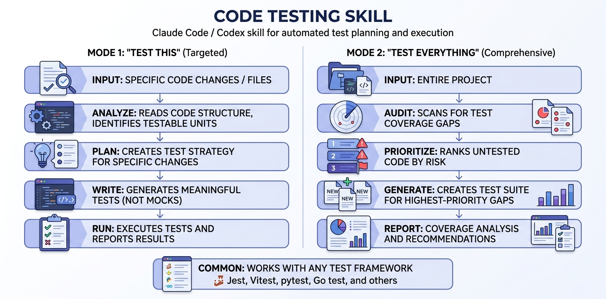

# Code Testing Skill for Claude Code and Codex

> Status: beta. This is a prompt/skill package, not a test framework. It improves how AI agents approach testing inside your existing project.

Also called **TestPilot** in examples and prompts.

## Why Use This Skill?

- Pushes Claude Code and Codex to inspect the project before writing tests.
- Separates targeted testing from full-project audits.
- Encourages running tests and reporting real failures instead of inventing confidence.
- Covers UI, logic, integration, regression, and edge-case review.

## Current Limitations

- It cannot replace project-specific test infrastructure.
- It works best when the repo already has runnable commands or clear setup docs.
- Agent output still needs review for risky changes or weak assertions.


A testing skill for **Claude Code** and **Codex** that teaches your AI coding agent to write, run, and audit tests intelligently — not just blindly generate them.

## How It Works



*TestPilot scans your project, detects test frameworks, writes meaningful tests, runs them, and reports real results.*

## What It Is

TestPilot is a skill file (a markdown instruction set) you drop into your Claude Code or Codex project. Once installed, your AI agent gains structured expertise in test generation, framework detection, and coverage analysis. Instead of writing generic, shallow tests, it produces meaningful tests that catch real bugs — while spotting issues in your UI, code, features, and logic.

## Two Modes

### "Test This" (Targeted)

You point at a file, function, or recent change. TestPilot analyzes the code, maps its dependencies, identifies edge cases, and writes targeted tests that follow your project's existing conventions. It then runs them and reports results.

### "Test Everything" (Comprehensive Audit)

A full project audit. TestPilot scans your codebase, identifies what has tests and what doesn't, prioritizes gaps by risk (auth and payments before getters and renderers), and systematically generates tests in batches. You get a report: coverage before/after, bugs found, and remaining gaps.

## Why It's Different

- **Framework-aware** — Automatically detects Vitest, Jest, pytest, Go test, RSpec, Cargo test, Deno, ExUnit, Mocha, and more. Matches your existing patterns.
- **Risk-prioritized** — Tests critical business logic first, not whatever's easiest.
- **Behavior-focused** — Asserts on what code does, not how it's wired internally.
- **Actually runs the tests** — Catches real failures, iterates on test bugs, reports honestly.
- **Bug detection** — Surfaces real bugs in your code, UI, features, and logic during the testing process.
- **Avoids anti-patterns** — No testing private internals, no implementation-mirroring, no mocking everything, no vanity coverage.

## Works With

Any language with a standard test runner:

- TypeScript / JavaScript (Vitest, Jest, Mocha, Deno)
- Python (pytest, unittest)
- Go
- Rust (Cargo)
- Ruby (RSpec)
- Elixir (ExUnit)
- And more

## Installation

### Claude Code

Copy the `skill/SKILL.md` file into your project:

```bash
mkdir -p .claude/skills/test
cp skill/SKILL.md .claude/skills/test/SKILL.md
```

Then invoke with `/test` or ask Claude to test your code.

### Codex

Add the contents of `skill/SKILL.md` to your Codex agent's system instructions or custom instructions file.

## Usage Examples

**Targeted testing:**
```
/test this — test the auth middleware I just changed
```

**Full audit:**
```
/test everything — audit test coverage for the whole project
```

**Specific file:**
```
/test src/utils/parser.ts
```

## Test Quality Principles

- Test behavior, not implementation
- One assertion concept per test
- Descriptive test names (`"returns 404 when user not found"` not `"test error"`)
- Arrange-Act-Assert structure
- No test interdependence
- Minimal mocking (only external services, time, randomness)
- Deterministic — no flaky tests

## License

MIT
