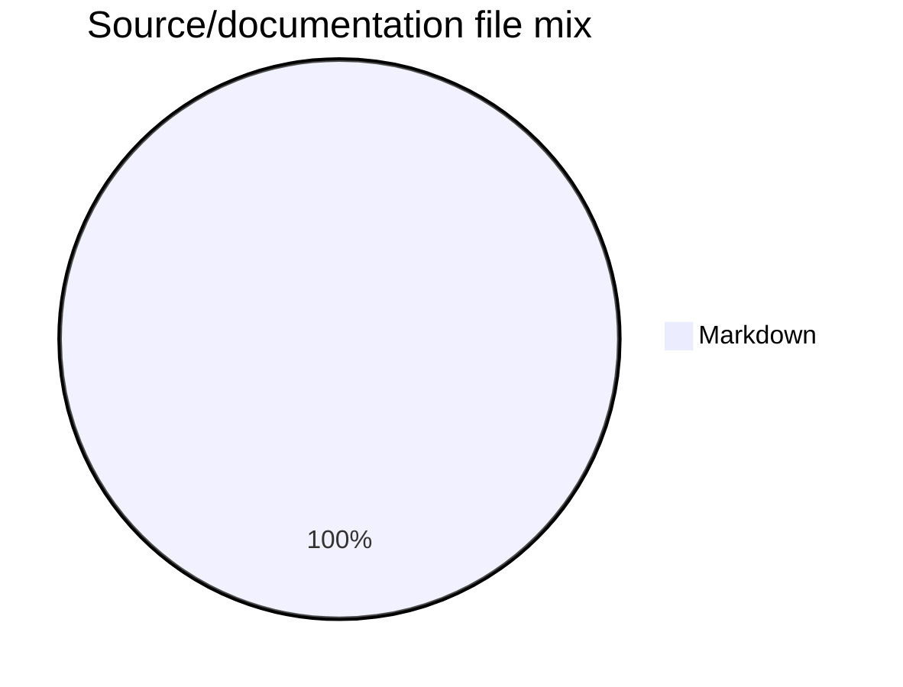

# Project Snapshot

Generated from the repository tree for public README/maintenance polish. Counts exclude `.git`, dependency folders, and build outputs.

## File Mix

- Markdown: 9 files (100%)

## Maintenance Checklist

- README describes purpose, setup, and limitations.
- CI runs baseline install/test/build checks where applicable.
- SECURITY.md explains vulnerability and secret handling.
- CHANGELOG.md tracks public changes.
- Issue and PR templates are available.
